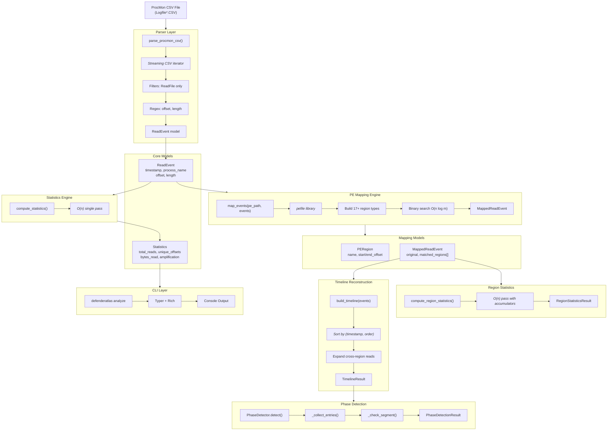
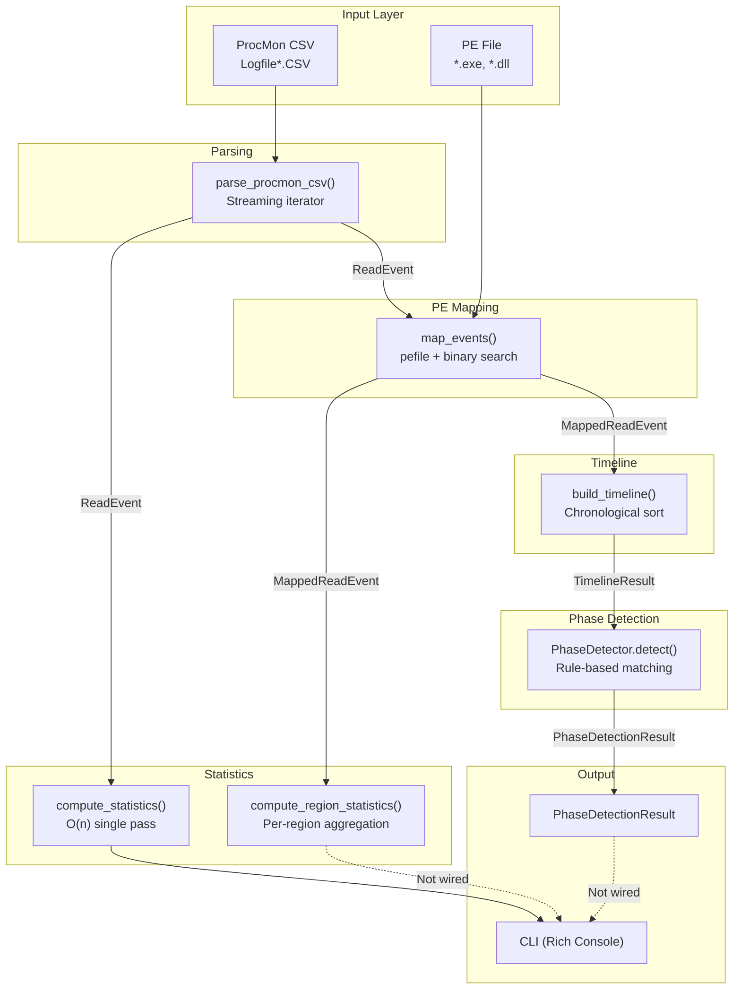

# DefenderAtlas — Current System Architecture

**Generated:** 2026-07-22
**Version:** 0.1.0 (Pre-Alpha)
**Source of Truth:** Actual implemented code

---

## SECTION 1: CURRENT IMPLEMENTED PIPELINE

The complete implemented flow verified against actual source code:

```
ProcMon CSV File
    │
    ▼
parse_procmon_csv()          [parsers/procmon.py]
    │  Streaming CSV parser
    │  Filters to ReadFile operations
    │  Handles BOM, hex offsets, commas
    │
    ▼
Iterator[ReadEvent]          [models/core.py]
    │  timestamp, process_name, process_id
    │  operation, path, offset, length, result
    │
    ├─── compute_statistics()           [statistics/compute.py]
    │        │
    │        ▼
    │    Statistics                     [models/core.py]
    │        total_reads, unique_offsets
    │        repeated_reads, bytes_read
    │        read_amplification
    │
    ├─── map_events(pe_path, events)    [mapping/pe_mapper.py]
    │        │  Uses pefile to parse PE
    │        │  Builds 17+ region types
    │        │  Binary search O(n log m)
    │        ▼
    │    Iterator[MappedReadEvent]      [mapping/models.py]
    │        original: ReadEvent
    │        matched_regions: list[PERegion]
    │        │
    │        ├─── compute_region_statistics() [statistics/region_statistics.py]
    │        │        │
    │        │        ▼
    │        │    RegionStatisticsResult
    │        │        total_regions, total_reads
    │        │        total_bytes, regions[]
    │        │
    │        └─── build_timeline()      [timeline/timeline_builder.py]
    │                 │  Sorts by (timestamp, order)
    │                 │  Expands cross-region reads
    │                 ▼
    │             TimelineResult        [timeline/timeline_builder.py]
    │                 start_time, end_time
    │                 duration, entries[]
    │                 │
    │                 └─── PhaseDetector.detect() [phases/phase_detector.py]
    │                          │  Rule-based matching
    │                          │  First-wins priority
    │                          │  Confidence scoring
    │                          ▼
    │                      PhaseDetectionResult
    │                          phases[]
    │                          confidence (0.0–1.0)
    │                          timeline_duration
    │
    ▼
Rich Console Output          [cli/app.py]
    Tables, Panels, Statistics
```

**Important:** The mapping → timeline → phase detection pipeline is fully
implemented in code but is NOT wired into the CLI. It is accessible
programmatically only. The CLI currently only runs: CSV → ReadEvent → Statistics.

---

## SECTION 2: CLI FLOW

Verified against `src/defenderatlas/cli/app.py`:

```
User
  │
  ▼
$ defenderatlas analyze trace.csv
  │
  ▼
Typer CLI (app.py)
  │  app = typer.Typer(...)
  │  Entry: defenderatlas.cli.app:app
  │
  ├─── main callback
  │      setup_logging(verbose)
  │      get_logger("defenderatlas.cli")
  │
  └─── analyze command
        │
        ├─── parse_procmon_csv(csv_path, skip_errors=True)
        │        Iterator[ReadEvent] (streaming, constant memory)
        │
        ├─── compute_statistics(events, file_size=None)
        │        Statistics model
        │
        └─── Rich Console Output
             │
             ├─── Panel("DefenderAtlas Analysis")
             ├─── Table("Read Statistics")
             │     Total Reads: N
             │     Unique Offsets: N
             │     Repeated Reads: N
             │     Bytes Read: N
             │     Read Amplification: Nx
             ├─── Panel(Processing Time)
             └─── Exit code 0
```

### CLI Commands (Implemented)

| Command | Status | Implementation |
|---------|--------|----------------|
| `defenderatlas` | ✅ Functional | Shows help text |
| `defenderatlas version` | ✅ Functional | Prints "DefenderAtlas v0.1.0" |
| `defenderatlas analyze` | ✅ Functional | Full CSV → Statistics pipeline |
| `defenderatlas capture` | ⚠️ Placeholder | Logs warning, exits 0 |
| `defenderatlas visualize` | ⚠️ Placeholder | Logs warning, exits 0 |
| `defenderatlas report` | ⚠️ Placeholder | Logs warning, exits 0 |

---

## SECTION 3: DATA MODEL FLOW

All models defined in `src/defenderatlas/models/core.py` and sub-packages:

```
┌─────────────────────────────────────────────────────────────┐
│                     MODELS (Pydantic v2)                     │
├─────────────────────────────────────────────────────────────┤
│                                                             │
│  Severity (StrEnum)                                         │
│    LOW │ MEDIUM │ HIGH │ CRITICAL                          │
│                                                             │
│  ReadEvent                                                  │
│    ├─ timestamp: datetime                                   │
│    ├─ process_name: str (min_length=1)                      │
│    ├─ process_id: int (gt=0)                                │
│    ├─ operation: str (min_length=1)                         │
│    ├─ path: str (min_length=1)                              │
│    ├─ offset: int (ge=0)                                    │
│    ├─ length: int (gt=0)                                    │
│    └─ result: str (min_length=1)                            │
│                                                             │
│  Statistics                                                 │
│    ├─ total_reads: int (ge=0)                               │
│    ├─ unique_offsets: int (ge=0)                            │
│    ├─ repeated_reads: int (ge=0)                            │
│    ├─ bytes_read: int (ge=0)                                │
│    └─ read_amplification: float (ge=0)                      │
│                                                             │
│  ScanPhase                                                  │
│    ├─ id: int (gt=0)                                        │
│    ├─ name: str (min_length=1)                              │
│    ├─ description: str (min_length=1)                       │
│    ├─ start_offset: int (ge=0)                              │
│    └─ end_offset: int (ge=0)  [validator: end >= start]     │
│                                                             │
│  Finding                                                    │
│    ├─ title: str (min_length=1)                             │
│    ├─ severity: Severity                                    │
│    ├─ description: str (min_length=1)                       │
│    └─ evidence: list[str]                                   │
│                                                             │
│  AnalysisResult                                             │
│    ├─ file_type: str (min_length=1)                         │
│    ├─ findings: list[Finding]                               │
│    ├─ phases: list[ScanPhase]                               │
│    └─ statistics: Statistics                                │
│                                                             │
└─────────────────────────────────────────────────────────────┘

┌─────────────────────────────────────────────────────────────┐
│                 MAPPING MODELS (mapping/models.py)          │
├─────────────────────────────────────────────────────────────┤
│                                                             │
│  PERegion                                                   │
│    ├─ name: str (min_length=1)                              │
│    ├─ start_offset: int (ge=0)                              │
│    ├─ end_offset: int (ge=0)  [validator: end >= start]     │
│    ├─ description: str (min_length=1)                       │
│    └─ overlaps(offset, length) -> bool                      │
│                                                             │
│  MappedReadEvent                                            │
│    ├─ original: ReadEvent                                   │
│    └─ matched_regions: list[PERegion]                       │
│                                                             │
└─────────────────────────────────────────────────────────────┘

┌─────────────────────────────────────────────────────────────┐
│              TIMELINE MODELS (timeline/timeline_builder.py) │
├─────────────────────────────────────────────────────────────┤
│                                                             │
│  TimelineEntry                                              │
│    ├─ timestamp: datetime                                   │
│    ├─ region_name: str (min_length=1)                       │
│    ├─ offset: int (ge=0)                                    │
│    ├─ length: int (gt=0)                                    │
│    ├─ operation: str (min_length=1)                         │
│    └─ process_name: str (min_length=1)                      │
│                                                             │
│  TimelineResult                                             │
│    ├─ start_time: datetime                                  │
│    ├─ end_time: datetime                                    │
│    ├─ duration: timedelta                                   │
│    ├─ entries: list[TimelineEntry]                          │
│    ├─ timeline_by_region() -> dict[str, list[TimelineEntry]]│
│    ├─ regions_in_order() -> list[str]                       │
│    ├─ first_region_accessed() -> str | None                 │
│    ├─ last_region_accessed() -> str | None                  │
│    └─ most_frequently_visited_regions(n) -> list[tuple]     │
│                                                             │
└─────────────────────────────────────────────────────────────┘

┌─────────────────────────────────────────────────────────────┐
│              PHASE MODELS (phases/phase_detector.py)        │
├─────────────────────────────────────────────────────────────┤
│                                                             │
│  PhaseRule                                                  │
│    ├─ name: str (min_length=1)                              │
│    ├─ description: str (min_length=1)                       │
│    ├─ required_regions: set[str]                            │
│    ├─ minimum_reads: int (ge=1, default=1)                  │
│    └─ optional_regions: list[str]                           │
│                                                             │
│  Phase                                                      │
│    ├─ name: str (min_length=1)                              │
│    ├─ description: str (min_length=1)                       │
│    ├─ start_time: str (min_length=1)                        │
│    ├─ end_time: str (min_length=1)                          │
│    ├─ duration: timedelta                                   │
│    └─ evidence: list[str]                                   │
│                                                             │
│  PhaseDetectionResult                                       │
│    ├─ phases: list[Phase]                                   │
│    ├─ confidence: float (ge=0.0, le=1.0)                    │
│    └─ timeline_duration: timedelta                          │
│                                                             │
└─────────────────────────────────────────────────────────────┘

┌─────────────────────────────────────────────────────────────┐
│           REGION STATISTICS (statistics/region_statistics.py)│
├─────────────────────────────────────────────────────────────┤
│                                                             │
│  RegionStatistic                                            │
│    ├─ region_name: str                                      │
│    ├─ read_count: int                                       │
│    ├─ unique_offsets: int                                   │
│    ├─ bytes_read: int                                       │
│    ├─ percentage_of_total_reads: float                      │
│    └─ percentage_of_total_bytes: float                      │
│                                                             │
│  RegionStatisticsResult                                     │
│    ├─ total_regions: int                                    │
│    ├─ total_reads: int                                      │
│    ├─ total_bytes: int                                      │
│    ├─ regions: list[RegionStatistic]                        │
│    ├─ top_regions_by_reads(n) -> list[RegionStatistic]      │
│    ├─ top_regions_by_bytes(n) -> list[RegionStatistic]      │
│    └─ top_n_regions(n) -> list[RegionStatistic]             │
│                                                             │
└─────────────────────────────────────────────────────────────┘
```

### Model Relationships

```
ReadEvent ──────────────────┐
  (input from parser)       │
                            ▼
                   MappedReadEvent
                  (original: ReadEvent,
                   matched_regions: list[PERegion])
                            │
                ┌───────────┴───────────┐
                ▼                       ▼
         TimelineEntry           RegionStatistic
  (from MappedReadEvent,         (aggregated from
   one per region)               MappedReadEvents)
                │
                ▼
         TimelineResult
         (entries: list[TimelineEntry])
                │
                ▼
         PhaseDetectionResult
         (phases: list[Phase],
          confidence: float)
```

---

## SECTION 4: DETAILED ANALYSIS PIPELINE (Mermaid)



---

## SECTION 5: DEFENDER RESEARCH PIPELINE

How DefenderAtlas currently reconstructs Defender's scanning behavior:

```
┌─────────────────────────────────────────────────────────────┐
│                  DEFENDER RESEARCH PIPELINE                   │
├─────────────────────────────────────────────────────────────┤
│                                                             │
│  ┌──────────────────┐                                       │
│  │  MsMpEng.exe     │  Microsoft Defender scanner           │
│  │  (ReadFile I/O)  │  reads target file from disk          │
│  └────────┬─────────┘                                       │
│           │                                                 │
│           ▼                                                 │
│  ┌──────────────────┐                                       │
│  │  ProcMon         │  Process Monitor captures all         │
│  │  (CSV Export)    │  file system I/O events               │
│  └────────┬─────────┘                                       │
│           │                                                 │
│           ▼                                                 │
│  ┌──────────────────┐                                       │
│  │  CSV Parser      │  Streaming parser extracts            │
│  │  (ReadEvent)     │  offset, length, timestamp            │
│  └────────┬─────────┘                                       │
│           │                                                 │
│           ▼                                                 │
│  ┌──────────────────┐                                       │
│  │  Statistics      │  Quantifies total reads,              │
│  │  Engine          │  amplification, coverage              │
│  └────────┬─────────┘                                       │
│           │                                                 │
│           ▼                                                 │
│  ┌──────────────────┐                                       │
│  │  PE Mapping      │  Maps each read offset to             │
│  │  Engine          │  PE structure (DOS, NT, .text, etc.)  │
│  └────────┬─────────┘                                       │
│           │                                                 │
│           ▼                                                 │
│  ┌──────────────────┐                                       │
│  │  Region Stats    │  Aggregates reads per PE region,      │
│  │  Engine          │  computes per-region percentages      │
│  └────────┬─────────┘                                       │
│           │                                                 │
│           ▼                                                 │
│  ┌──────────────────┐                                       │
│  │  Timeline        │  Reconstructs chronological           │
│  │  Reconstruction  │  sequence of region accesses          │
│  └────────┬─────────┘                                       │
│           │                                                 │
│           ▼                                                 │
│  ┌──────────────────┐                                       │
│  │  Phase Detection │  Identifies scanning phases           │
│  │  (Rule-based)    │  using configurable rules             │
│  └────────┬─────────┘                                       │
│           │                                                 │
│           ▼                                                 │
│  ┌──────────────────┐                                       │
│  │  Research        │  Answers questions about              │
│  │  Insights        │  Defender's scanning strategy         │
│  └──────────────────┘                                       │
│                                                             │
└─────────────────────────────────────────────────────────────┘
```

### What DefenderAtlas Can Currently Answer

| Question | Supported? | Module |
|----------|-----------|--------|
| How much did Defender read from the file? | ✅ Yes | `statistics/compute.py` |
| How many unique offsets were accessed? | ✅ Yes | `statistics/compute.py` |
| What is the read amplification factor? | ✅ Yes | `statistics/compute.py` |
| Which PE regions were accessed? | ✅ Yes | `mapping/pe_mapper.py` |
| How many reads per PE region? | ✅ Yes | `statistics/region_statistics.py` |
| What percentage of the file was in each region? | ✅ Yes | `statistics/region_statistics.py` |
| In what order were regions accessed? | ✅ Yes | `timeline/timeline_builder.py` |
| What was the first/last region accessed? | ✅ Yes | `timeline/timeline_builder.py` |
| Which regions were visited most frequently? | ✅ Yes | `timeline/timeline_builder.py` |
| What phase does a read belong to (rule-based)? | ✅ Yes | `phases/phase_detector.py` |
| What is the detection confidence? | ✅ Yes | `phases/phase_detector.py` |
| What are the matched/unmatched rules? | ✅ Yes | `phases/phase_detector.py` |

---

## SECTION 6: ARCHITECTURE DIAGRAM (Mermaid)

```mermaid
graph TB
    subgraph CLI["CLI Layer (Typer + Rich)"]
        APP["app.py<br/>defenderatlas CLI"]
        LOG["_logging.py<br/>RichHandler"]
    end
    
    subgraph Parsers["Parser Layer"]
        PROC["procmon.py<br/>parse_procmon_csv()"]
        ERR_P["errors.py<br/>ParserError hierarchy"]
    end
    
    subgraph Statistics["Statistics Layer"]
        COMP["compute.py<br/>compute_statistics()"]
        RSTAT["region_statistics.py<br/>compute_region_statistics()"]
    end
    
    subgraph Mapping["Mapping Layer"]
        PE["pe_mapper.py<br/>map_events()"]
        MOD_M["models.py<br/>PERegion, MappedReadEvent"]
        ERR_M["errors.py<br/>MappingError hierarchy"]
    end
    
    subgraph Timeline["Timeline Layer"]
        TB["timeline_builder.py<br/>build_timeline()"]
    end
    
    subgraph Phases["Phase Detection Layer"]
        PD["phase_detector.py<br/>PhaseDetector class"]
    end
    
    subgraph Models["Core Models"]
        CORE["core.py<br/>ReadEvent, Statistics<br/>ScanPhase, Finding<br/>AnalysisResult, Severity"]
    end
    
    subgraph Analyzers["Analyzer Framework"]
        BASE["base.py<br/>Analyzer ABC"]
        PE_A["pe.py<br/>PEAnalyzer"]
        ZIP_A["zip.py<br/>ZIPAnalyzer"]
        PDF_A["pdf.py<br/>PDFAnalyzer"]
        OFF_A["office.py<br/>OfficeAnalyzer"]
        PNG_A["png.py<br/>PNGAnalyzer"]
    end
    
    subgraph Tests["Test Suite"]
        T_M["test_models.py<br/>57 tests"]
        T_P["test_parsers.py<br/>41 tests"]
        T_A["test_analyzers.py<br/>37 tests"]
        T_S["test_statistics.py<br/>38 tests"]
        T_RS["test_region_statistics.py<br/>43 tests"]
        T_MAP["test_mapping.py<br/>40 tests"]
        T_TL["test_timeline.py<br/>52 tests"]
        T_PD["test_phase_detector.py<br/>58 tests"]
        T_CL["test_cli.py<br/>12 tests"]
    end
    
    subgraph Deps["Dependencies"]
        PYD["pydantic>=2.0.0"]
        TYP["typer>=0.12.0"]
        RICH["rich>=13.0.0"]
        PE_L["pefile>=2023.2.7"]
    end
    
    APP --> PROC
    APP --> COMP
    APP --> LOG
    PROC --> ERR_P
    PROC --> CORE
    COMP --> CORE
    RSTAT --> MOD_M
    PE --> MOD_M
    PE --> ERR_M
    PE --> PE_L
    TB --> MOD_M
    PD --> TB
    BASE --> CORE
    PE_A --> BASE
    ZIP_A --> BASE
    PDF_A --> BASE
    OFF_A --> BASE
    PNG_A --> BASE
    
    APP -.-> PYD
    APP -.-> TYP
    APP -.-> RICH
    PE -.-> PE_L
    
    T_M --> CORE
    T_P --> PROC
    T_P --> ERR_P
    T_A --> BASE
    T_S --> COMP
    T_RS --> RSTAT
    T_MAP --> PE
    T_TL --> TB
    T_PD --> PD
    T_CL --> APP
```



---

## SECTION 7: MODULE STATUS TABLE

| Module | File | Status | LOC | Tests | Purpose |
|--------|------|--------|-----|-------|---------|
| **Models** | `models/core.py` | ✅ Complete | 200 | 57 | Core data models (ReadEvent, Statistics, etc.) |
| **Parser Errors** | `parsers/errors.py` | ✅ Complete | 52 | — | Exception hierarchy for parser |
| **ProcMon Parser** | `parsers/procmon.py` | ✅ Complete | 297 | 41 | Streaming CSV parser for ProcMon exports |
| **Analyzer ABC** | `analyzers/base.py` | ✅ Complete | 40 | 37 | Abstract base class for file analyzers |
| **PE Analyzer** | `analyzers/pe.py` | ⚠️ Partial | 71 | — | Magic-byte detection + placeholder analyze() |
| **ZIP Analyzer** | `analyzers/zip.py` | ⚠️ Stub | 43 | — | Magic-byte detection + NotImplementedError |
| **PDF Analyzer** | `analyzers/pdf.py` | ⚠️ Stub | 43 | — | Magic-byte detection + NotImplementedError |
| **Office Analyzer** | `analyzers/office.py` | ⚠️ Stub | 43 | — | Magic-byte detection + NotImplementedError |
| **PNG Analyzer** | `analyzers/png.py` | ⚠️ Stub | 43 | — | Magic-byte detection + NotImplementedError |
| **Statistics** | `statistics/compute.py` | ✅ Complete | 89 | 38 | Aggregate read statistics (O(n) pass) |
| **Region Statistics** | `statistics/region_statistics.py` | ✅ Complete | 291 | 43 | Per-PE-region statistics |
| **Mapping Errors** | `mapping/errors.py` | ✅ Complete | 25 | — | Exception hierarchy for mapping |
| **Mapping Models** | `mapping/models.py` | ✅ Complete | 150 | — | PERegion, MappedReadEvent models |
| **PE Mapper** | `mapping/pe_mapper.py` | ✅ Complete | 544 | 40 | Full PE structure mapping via pefile |
| **Timeline Builder** | `timeline/timeline_builder.py` | ✅ Complete | 314 | 52 | Chronological event reconstruction |
| **Phase Detector** | `phases/phase_detector.py` | ✅ Complete | 484 | 58 | Rule-based phase detection engine |
| **CLI App** | `cli/app.py` | ⚠️ Partial | 344 | 12 | Typer CLI (analyze works, others placeholder) |
| **CLI Logging** | `cli/_logging.py` | ✅ Complete | 43 | — | Rich logging setup |
| **Detectors** | `detectors/__init__.py` | ❌ Empty | 0 | — | Placeholder package |
| **Visualization** | `visualization/__init__.py` | ❌ Empty | 0 | — | Placeholder package |
| **Utils** | `utils/__init__.py` | ❌ Empty | 0 | — | Placeholder package |
| **Reverse** | `reverse/__init__.py` | ❌ Empty | 0 | — | Placeholder package |
| **Capture** | `capture/__init__.py` | ❌ Empty | 0 | — | Placeholder package |
| **Reports** | `reports/__init__.py` | ❌ Empty | 0 | — | Placeholder package |

### Summary

| Category | Count | Status |
|----------|-------|--------|
| Complete modules | 10 | Production-ready |
| Partial modules | 3 | Working but incomplete |
| Stub modules | 5 | Magic-byte detection only |
| Empty packages | 6 | Docstring-only placeholders |
| Test files | 10 | 394+ tests passing |
| Total LOC (src) | ~3,200 | Excluding tests |

---

## SECTION 8: RESEARCH CAPABILITY SUMMARY

### What DefenderAtlas CAN Currently Do

| Capability | Module | Verified |
|------------|--------|----------|
| Parse ProcMon CSV exports | `parsers/procmon.py` | ✅ Yes |
| Handle BOM, hex offsets, commas | `parsers/procmon.py` | ✅ Yes |
| Stream-parse (constant memory) | `parsers/procmon.py` | ✅ Yes |
| Compute total reads / bytes / amplification | `statistics/compute.py` | ✅ Yes |
| Detect PE files by magic bytes | `analyzers/pe.py` | ✅ Yes |
| Parse PE files with pefile | `mapping/pe_mapper.py` | ✅ Yes |
| Map reads to 17+ PE region types | `mapping/pe_mapper.py` | ✅ Yes |
| Binary-search region lookup | `mapping/pe_mapper.py` | ✅ Yes |
| Compute per-region statistics | `statistics/region_statistics.py` | ✅ Yes |
| Sort events chronologically | `timeline/timeline_builder.py` | ✅ Yes |
| Expand cross-region reads | `timeline/timeline_builder.py` | ✅ Yes |
| Group entries by region | `timeline/timeline_builder.py` | ✅ Yes |
| Detect phases with rules | `phases/phase_detector.py` | ✅ Yes |
| Score detection confidence | `phases/phase_detector.py` | ✅ Yes |
| Handle first-wins priority | `phases/phase_detector.py` | ✅ Yes |
| Display results via Rich | `cli/app.py` | ✅ Yes |

### What DefenderAtlas CANNOT Currently Do

| Limitation | Affected Module | Notes |
|------------|----------------|-------|
| Cannot run full pipeline from CLI | `cli/app.py` | Only CSV → Statistics wired in |
| Cannot visualize results | `visualization/` | Empty package |
| Cannot generate reports | `reports/` | Empty package |
| Cannot capture ProcMon data | `capture/` | Empty package |
| Cannot reverse-engineer binaries | `reverse/` | Empty package |
| Cannot analyze ZIP files | `analyzers/zip.py` | NotImplementedError |
| Cannot analyze PDF files | `analyzers/pdf.py` | NotImplementedError |
| Cannot analyze Office files | `analyzers/office.py` | NotImplementedError |
| Cannot analyze PNG files | `analyzers/png.py` | NotImplementedError |
| No pre-built phase rules | `phases/` | Rules must be created per-file |

---

## SECTION 9: EXPORTABLE DIAGRAMS

### 9A. Complete Mermaid Diagram



### 9B. Graphviz DOT Diagram

```dot
digraph DefenderAtlas {
    rankdir=TB;
    fontname="Helvetica";
    node [shape=box, style=filled, fontname="Helvetica"];
    edge [fontname="Helvetica"];
    
    // Input
    CSV [label="ProcMon CSV\nFile", fillcolor="#E8F5E9"];
    PE [label="PE File\n(exe/dll)", fillcolor="#E8F5E9"];
    
    // Parsing
    PARSE [label="parse_procmon_csv()\nStreaming Iterator", fillcolor="#E3F2FD"];
    
    // Models
    RE [label="ReadEvent\n(timestamp, offset,\nlength, path)", fillcolor="#FFF3E0"];
    STATS_M [label="Statistics\n(total_reads, bytes_read,\namplification)", fillcolor="#FFF3E0"];
    MRE [label="MappedReadEvent\n(original, matched_regions)", fillcolor="#FFF3E0"];
    PER [label="PERegion\n(name, start/end_offset)", fillcolor="#FFF3E0"];
    TE [label="TimelineEntry\n(timestamp, region_name,\noffset, length)", fillcolor="#FFF3E0"];
    TR [label="TimelineResult\n(entries[], duration)", fillcolor="#FFF3E0"];
    PR [label="PhaseRule\n(name, required_regions)", fillcolor="#FFF3E0"];
    PH [label="Phase\n(name, start/end_time,\nevidence)", fillcolor="#FFF3E0"];
    PDR [label="PhaseDetectionResult\n(phases[], confidence)", fillcolor="#FFF3E0"];
    
    // Engines
    STAT_E [label="compute_statistics()\nO(n) pass", fillcolor="#E1F5FE"];
    RSTAT_E [label="compute_region_statistics()\nPer-region accumulators", fillcolor="#E1F5FE"];
    MAP_E [label="map_events()\npefile + binary search", fillcolor="#E1F5FE"];
    TL_E [label="build_timeline()\nChronological sort", fillcolor="#E1F5FE"];
    DET_E [label="PhaseDetector.detect()\nRule-based matching", fillcolor="#E1F5FE"];
    
    // Output
    CLI [label="CLI\n(defenderatlas analyze)\nRich Console", fillcolor="#F3E5F5"];
    
    // Edges
    CSV -> PARSE;
    PE -> MAP_E;
    PARSE -> RE;
    RE -> STAT_E;
    RE -> MAP_E;
    MAP_E -> MRE;
    MAP_E -> PER;
    STAT_E -> STATS_M;
    STATS_M -> CLI;
    MRE -> RSTAT_E;
    MRE -> TL_E;
    RSTAT_E -> [style=dashed, label="Not wired"];
    TL_E -> TR;
    TR -> DET_E;
    DET_E -> PDR;
    PDR -> [style=dashed, label="Not wired"];
    
    // Legend
    subgraph legend {
        label="Legend";
        node [shape=plaintext];
        leg1 [label="● Green = Input"];
        leg2 [label="● Blue = Engine"];
        leg3 [label="● Orange = Data Model"];
        leg4 [label="● Purple = Output"];
        leg5 [label="-- Dashed = Not wired to CLI"];
    }
}
```

### 9C. PNG Export Recommendations

To export diagrams as PNG:

**Mermaid (recommended):**
1. Use [mermaid.live](https://mermaid.live) for interactive editing
2. Export as SVG or PNG at 2x resolution
3. For README: use `mermaid` fenced code blocks (GitHub renders natively)

**Graphviz:**
```bash
# Install graphviz
pip install graphviz

# Render DOT to PNG
dot -Tpng -Gdpi=300 architecture.dot -o architecture.png

# Render to SVG (better for web)
dot -Tsvg architecture.dot -o architecture.svg
```

**For IEEE paper / conference slides:**
- Use SVG format for scalability
- Minimum 300 DPI for print
- Use consistent color scheme (blue=engines, orange=models, green=input)
- Include legend in all exported diagrams

---

## SECTION 10: ARCHITECTURE SUMMARY

### Design Principles (Verified in Code)

| Principle | Implementation | Evidence |
|-----------|---------------|----------|
| **Streaming/Iterator** | `parse_procmon_csv()` returns `Iterator[ReadEvent]` | Constant memory, O(n) |
| **Pydantic v2 Models** | All data classes use `BaseModel` with validation | Strict type checking |
| **SOLID Principles** | Abstract `Analyzer` ABC, single-responsibility modules | `analyzers/base.py` |
| **Type Safety** | `mypy --strict` enforced, `TYPE_CHECKING` guards | All files pass mypy |
| **Error Handling** | Custom exception hierarchies | `parsers/errors.py`, `mapping/errors.py` |
| **Functional Core** | Pure functions for computation | `compute_statistics()`, `build_timeline()` |
| **Test-Driven** | 394+ tests, comprehensive edge cases | 10 test files |

### Technology Stack

| Component | Technology | Version |
|-----------|-----------|---------|
| Language | Python | >=3.12 |
| Build | Hatchling | — |
| CLI | Typer | >=0.12.0 |
| Console | Rich | >=13.0.0 |
| Models | Pydantic | >=2.0.0 |
| PE Parsing | pefile | >=2023.2.7 |
| Linting | ruff | Dev dep |
| Formatting | black | Dev dep |
| Type Checking | mypy (strict) | Dev dep |
| Testing | pytest + coverage | Dev dep |

### Current Maturity Assessment

| Aspect | Rating | Notes |
|--------|--------|-------|
| **Parser** | 🟢 Production | Handles edge cases, streaming, error-tolerant |
| **Statistics** | 🟢 Production | O(n), tested with 5000+ events |
| **PE Mapping** | 🟢 Production | Real PE parsing, 17+ regions, binary search |
| **Region Stats** | 🟢 Production | Cross-region handling, percentages |
| **Timeline** | 🟢 Production | Stable sort, cross-region expansion |
| **Phase Detection** | 🟢 Production | Rule-based, confidence scoring, extensible |
| **CLI** | 🟡 Functional | `analyze` works; capture/visualize/report are stubs |
| **Analyzers** | 🟡 Framework | ABC defined; only PE has placeholder |
| **Visualization** | 🔴 Not Started | Empty package |
| **Reports** | 🔴 Not Started | Empty package |
| **Capture** | 🔴 Not Started | Empty package |
| **Integration** | 🟡 Partial | Pipeline works programmatically, not from CLI |

### Overall Assessment

**DefenderAtlas is a well-architected, type-safe, test-covered framework** with
a complete analysis pipeline implemented at the library level. The core
engines (parser, statistics, mapping, timeline, phase detection) are
production-ready and thoroughly tested. The main gaps are:

1. **CLI integration** — The full pipeline is not wired into the CLI
2. **Visualization** — No rendering of results
3. **Report generation** — No export formats
4. **ProcMon capture** — No automated data collection
5. **Pre-built rules** — Phase detection rules must be created per-file

The architecture is solid and extensible. The next steps should focus on
wiring the existing engines into the CLI and building the visualization
and report layers on top of the proven foundation.

---

*This document reflects the actual implemented code as of 2026-07-22.*
*No planned or future functionality is included.*
